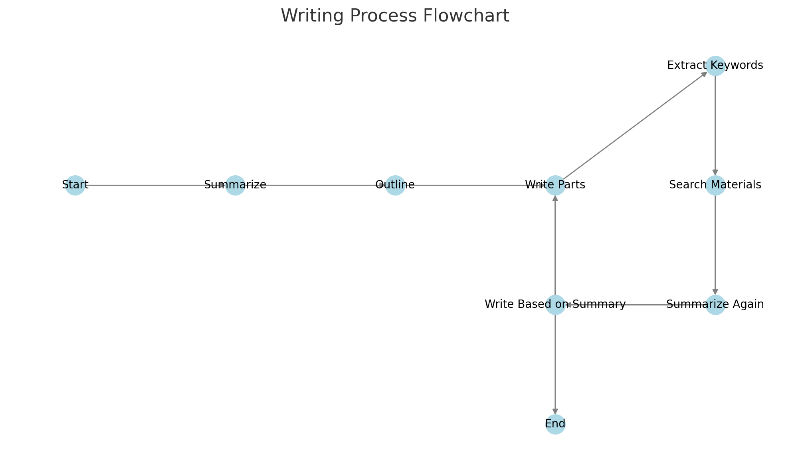

---
# rwkv_auto_write_simple


---

中文请看 [README_CN.md](./README_CN.md).

---
## Project Introduction

The main purpose of this project is to serve as a simple example of using the RWKV API. The architecture is extremely simple, even non-programmers can understand how to develop a RWKV program through AI.

## Workflows



## File Description

- `main.py`: The main program of the project.
- `mainth.py`: A multithreaded version of the main program.
- `workflow.jpg`: This is the workflow diagram of the project, which can help you understand the workflow of the program.
- `requirements.txt`: This is a text file containing the Python packages required by the project.

## Installation and Running the Program

1. First, you need to install the dependencies of the project. Run the following command in your terminal:

   ```
   pip install -r requirements.txt
   ```

2. Enter main.py or mainth.py, configure the reference file path, the output file path, and the article topic，Run `main.py`:

   ```
   python main.py
   ```

   Or, if you want to run the multithreaded version of the program, you can run `mainth.py`:

   ```
   python mainth.py
   ```

## Advantages

- Simple architecture, lightweight, no need to configure vector libraries and other troublesome things, can run on very low configurations.

## Disadvantages

- Very slow, it uses some ideas to replace the vector library with language models, so...

---

For the Chinese version of this README, please refer to [README_CN.md](./README_CN.md).

---
