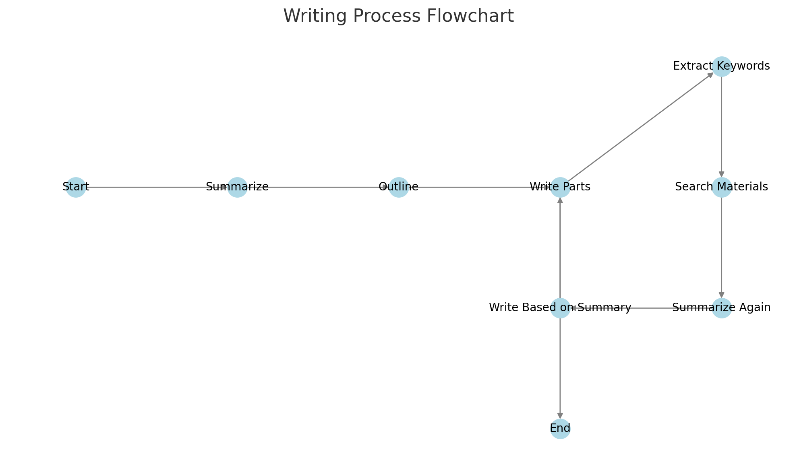

# rwkv_auto_write_simple

## 项目简介

本项目的主要目的是作为一个简单的 RWKV API 使用示例。其架构极其简单，即使是编程的小白也可以通过自己查看函数名和注释来轻松理解如何开发 RWKV 程序。

## 流程图



## 文件说明

- `main.py`：项目的主程序。
- `mainth.py`：多线程版本的主程序。
- `workflow.jpg`：这是项目的流程图，可以帮助你理解程序的工作流程。
- `requirements.txt`：这是一个包含项目所需 Python 包的文本文件。

## 安装和运行程序

1. 首先，你需要安装项目的依赖。在你的终端中，运行以下命令：

   ```
   pip install -r requirements.txt
   ```

2. 进入main.py或mainth.py，配置参考文件路径、和输出文件路径、和文章题目，运行 `main.py`：

   ```
   python main.py
   ```

   或者，如果你想要运行多线程版本的程序，你可以运行 `mainth.py`：

   ```
   python mainth.py
   ```

## 优点

- 架构简单、轻量化，无需配置向量库等麻烦的东西，非常低配置也可以运行。

## 缺点

- 非常慢，用了一些通过语言模型代替向量库的思路，所以。。。

